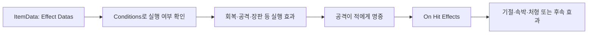

# 추가 이펙트 사용 설명서

이 문서는 새로 추가한 게임플레이 이펙트를 **Unity Inspector에서 설정하고 아이템에 연결하는 방법**을 설명한다. 회복량·피해·대상·조건은 이펙트 에셋에서 설정하고, 화면에 보이는 그림·파티클·소리는 별도의 연출 에셋이나 프리팹을 연결한다.

프로젝트 버전은 Unity **6000.4.4f1**이다. 아래 필드명은 기본 Inspector 표시 이름을 기준으로 썼고, 필요한 곳에는 실제 코드 필드명도 적었다. 예제의 전이 거리·공격 간격·미정 장판 범위는 테스트용 설정이다. 새 기획값을 입력할 때 함께 조정한다.

## 목차

1. [가장 먼저 해보기: 따뜻한 수프](#1-가장-먼저-해보기-따뜻한-수프)
2. [파일 위치와 연결 규칙](#2-파일-위치와-연결-규칙)
3. [이미 연결된 아이템 16개](#3-이미-연결된-아이템-16개)
4. [새 이펙트 에셋 만들기](#4-새-이펙트-에셋-만들기)
5. [회복·지속 회복·체력 비용·보호막](#5-회복지속-회복체력-비용보호막)
6. [연쇄 공격과 대상 선택](#6-연쇄-공격과-대상-선택)
7. [직선·왕복·회전·추적 투사체](#7-직선왕복회전추적-투사체)
8. [명중 후 효과와 로켓화살 폭발](#8-명중-후-효과와-로켓화살-폭발)
9. [상태 부여·조회·소비·정화](#9-상태-부여조회소비정화)
10. [장판 생성·조회·소비·체류](#10-장판-생성조회소비체류)
11. [조건 분기: 무지개와 모자](#11-조건-분기-무지개와-모자)
12. [쿨다운 조작과 회복속도](#12-쿨다운-조작과-회복속도)
13. [소환물 개조·합체·오라](#13-소환물-개조합체오라)
14. [가중치 무작위·배율·종료 후 실행](#14-가중치-무작위배율종료-후-실행)
15. [속박·타겟 변경·처형·표식·시간 정지](#15-속박타겟-변경처형표식시간-정지)
16. [부채꼴 공격과 이동제어 모양](#16-부채꼴-공격과-이동제어-모양)
17. [그림·파티클·소리 연결](#17-그림파티클소리-연결)
18. [작동하지 않을 때 확인할 것](#18-작동하지-않을-때-확인할-것)
19. [확인·저장·Git에 올리기](#19-확인저장git에-올리기)

## 1. 가장 먼저 해보기: 따뜻한 수프

이미 연결된 예제로 설정 구조를 먼저 확인한다.

1. Unity를 닫은 상태에서 `work`의 최신 내용을 가져온다. [가져오기 안내](WorkBranchGuide.md)의 명령어를 사용한다.
2. Unity에서 프로젝트를 열고 컴파일이 끝날 때까지 기다린다.
3. Project 창에서 `Assets/Data/Scriptable/Item/Items/02.Food/Food3.asset`을 선택한다.
4. Inspector의 **Effect Datas**에 `WarmSoup_Effects`가 연결되어 있는지 확인한다. 이 아이템에는 이미 연결했으므로 같은 에셋을 다시 추가하지 않는다.
5. `Assets/Data/AdditionalEffectsExamples/WarmSoup_Effects.asset`을 선택한다. **Effects** 안에 `WarmSoup_Heal15`와 `WarmSoup_Regen1For5Seconds`가 있고, 배율 4개는 모두 `1`이다.
6. 전투 씬에서 식물의 HP가 최대 HP보다 충분히 낮을 때 수프를 사용한다. 즉시 15 회복하고, 1초 뒤부터 초당 1씩 5회 회복하는지 확인한다. 최대 HP에 도달하면 실제 회복량은 줄어든다.

처음 새 아이템을 연결할 때도 **ItemData 선택 → Effect Datas에 실행 에셋 연결 → 게임에서 사용** 순서를 따른다. 이펙트 에셋만 만드는 것으로 인벤토리에 아이템이 추가되지는 않는다.

## 2. 파일 위치와 연결 규칙

| 위치 | 들어 있는 것 |
| --- | --- |
| `Assets/Data/AdditionalEffects` | CSV 수치로 구성한 설정 에셋 28개 |
| `Assets/Data/AdditionalEffectsExamples` | 수프·보호막·연쇄 공격·상태·장판 예제 21개와 쿨다운 버프 설정 10개 |
| `Assets/Data/Scriptable/Item/Items` | 실제 아이템의 ItemData. 시리즈 폴더별로 구분 |
| `Assets/Data/Scriptable/Item/Effect` | 기존 공격·버프·조건 에셋 |
| `Docs/ItemEffectCoverage.csv` | 원본 318행의 아이템별 연결 계획과 ItemData 경로 |
| `Docs/AdditionalEffectsConfiguration.json` | 이번에 연결한 16개 아이템의 ID 목록 |

연결할 자리는 에셋 종류에 따라 다르다.

| 에셋 종류 | 연결할 자리 | 예 |
| --- | --- | --- |
| 실행 효과 `ItemEffectData` | ItemData의 **Effect Datas**, 또는 다른 효과의 **Effects** | 회복, 연쇄 공격, 장판 생성, 시간 정지 |
| 명중 효과 `HitEffectData` | 공격 효과의 **On Hit Effects** | 기절, 속박, 처형, 명중 후 폭발 |
| 조건 `ItemEffectConditionData` | 실행 효과의 **Conditions** | 상태 보유, 특정 장판 존재, 소환물 존재 |
| 정의·대상 설정 | 실행 효과의 해당 참조 필드 | Status Definition, Area Definition, Target Resolver |
| 소환 행동 모듈 | 소환 효과 또는 소환 프리팹의 **Modules** | 오라, 기존 Turret / Contact / Item Throw |



Conditions를 비우면 항상 실행한다. **Condition Mode = All**이면 모든 조건을, **Any**이면 하나 이상의 조건을 만족해야 한다. Conditional 에셋에서는 조건이 실행 차단 대신 True/False 분기를 선택한다.

여러 아이템이 같은 효과 에셋을 참조하면 그 에셋의 수정이 모두에 반영된다. 한 아이템만 바꿀 때는 효과와 필요한 하위 에셋을 복제하고 참조를 교체한다.

## 3. 이미 연결된 아이템 16개

아래 아이템은 이번에 Effect Datas를 연결했다. 경로의 앞부분은 `Assets/Data/Scriptable/Item/Items/`이다.

| 아이템 | ItemData 경로 | 연결된 주 효과 |
| --- | --- | --- |
| 따뜻한 수프 | `02.Food/Food3.asset` | 즉시 15 + 초당 1, 5초 |
| 꿀단지 | `02.Food/Food18.asset` | 즉시 30 + 초당 2, 8초 |
| 우유 | `02.Food/Food23.asset` | 식물·플레이어의 정화 가능한 해로운 상태 제거 |
| 케이크 | `02.Food/Food25.asset` | 식물 HP 50 회복 |
| 오리하르콘주괴 | `03.Mineral/Mineral29.asset` | 무지개 광맥 장판 15초 |
| 오리하르콘덩어리 | `03.Mineral/Mineral30.asset` | 무지개 축복 상태 15초 |
| 청록고등어 | `05.Fishing/Fishing4.asset` | 처음 8, 도탄 6, 최대 총 4회 |
| 새우 | `05.Fishing/Fishing12.asset` | 무작위 서로 다른 적 최대 4명, 각각 6 |
| 전기뱀방어 | `05.Fishing/Fishing16.asset` | 최대 5명, 20/17/14/11/8 + 기절 0.5초 |
| 잉어 | `05.Fishing/Fishing23.asset` | 최대 6회, 각각 10, 이전에 맞은 적 재선택 가능 |
| 속성 스태프3 | `08.Magic/Magic6.asset` | 최대 3명, 각각 8 + 기절 0.3초 |
| 심연 포션 | `08.Magic/Magic18.asset` | 무지개 장판 + 축복 상태, 각각 15초 |
| 마법사의 모자 | `08.Magic/Magic20.asset` | 기본 45초 / 무지개 조건 30초 뒤 쿨다운 준비 완료 |
| 대마법사의 모자 | `08.Magic/Magic25.asset` | 기본 15초 / 무지개 조건 10초 뒤 쿨다운 준비 완료 |
| 마법사의 상자 | `08.Magic/Magic27.asset` | Common/Magic 후보 14개 중 5개 추첨·실행 |
| 타이무 스토쁘 | `08.Magic/Magic30.asset` | 적 행동·적 투사체·적 스폰 5초 정지 |

상자의 후보 중 Effect Datas가 비어 있는 아이템은 해당 효과를 연결해야 행동이 발생한다. 무지개 장판의 범위·연출, 연쇄 공격의 탐색 거리·간격 등은 기획값을 확정해 조정한다.

**별도 연결이 필요한 구성 요소:**

- 로켓화살: `Weapon28_FirstHitExplosion`을 기존 조건부 직사각형 공격의 **On Hit Effects**에 추가한다. [8절](#8-명중-후-효과와-로켓화살-폭발) 참고.
- 속성 스태프6: `Magic9_BeamAlliesHeal3`을 `Magic9.asset`의 **Effect Datas**에 기존 공격과 함께 추가한다. 아군 직사각형 판정과 공격의 시작 위치·방향을 맞춘다.
- 크리스탈 파이: `Food30_CrystalPieHeal100_Component`는 식물 HP 100 회복 구성 요소다. 기획의 나머지 버프와 함께 연결한다.

## 4. 새 이펙트 에셋 만들기

1. Project 창에서 저장할 폴더를 선택한다. 새 아이템 설정은 자신의 폴더에 모아 두어도 된다.
2. 빈 공간을 우클릭해 **Create → GameData**에서 아래 메뉴를 선택한다.
3. 이름을 `아이템_동작_수치`처럼 정한다. 예: `MyFood_Heal20`.
4. 대상과 수치를 입력한 뒤 ItemData의 Effect Datas 또는 공격의 On Hit Effects에 드래그한다.
5. 필요한 Conditions와 연출을 연결하고 저장한다.

아래는 **Create → GameData** 이후의 실제 메뉴 경로다.

| 만들 효과 | 메뉴 |
| --- | --- |
| 즉시 회복·피해·비용 | `Items → Effects → Health → Health Change` |
| 지속 회복 / 보호막 | `Items → Effects → Health → Regeneration` / `Shield` |
| 연쇄 / 이동 투사체 / 부채꼴 공격 | `Items → Effects → Attack → Chain Attack` / `Projectile Attack` / `Sector Damage Area` |
| 적에게 명중 효과 직접 적용 | `Items → Effects → Attack → Apply Hit Effects` |
| 명중 후 다른 효과 실행 | `Items → Hit Effects → Execute Effects` |
| 상태 키 / 상태 대상 설정 | `Items → Status → Definition` / `Buffs → Targets → Context Status` |
| 상태 부여 / 조회 | `Items → Effects → Buff` / `Items → Conditions → Has Status Key` |
| 상태 소비 / 정화 | `Items → Effects → Status → Consume Checked Status` / `Cleanse` |
| 장판 정의 / 생성 | `Items → Areas → Definition` / `Items → Effects → Attack → Defined Area` |
| 장판 조회 / 소비 | `Items → Conditions → Has Area` / `Items → Effects → Area → Consume Checked Areas` |
| True/False 분기 | `Items → Effects → Branch → Conditional` |
| 쿨다운 / 아이템 하위 태그 | `Items → Effects → Cooldown Control` / `Items → Item Tag` |
| 전체 아이템 / 전체 가방 버프 대상 | `Buffs → Targets → All Items` / `All Bags` |
| 소환물 종류 / 조회 | `Items → Summons → Definition` / `Items → Conditions → Has Summon` |
| 소환물 개조 / 합체 / 오라 | `Items → Effects → Summon → Modify` / `Transform` / `Items → Summon Modules → Aura` |
| 무작위 / 배율 / 종료 후 실행 | `Items → Effects → Weighted Random` / `Scaled Effects` / `Then Effects` |
| 속박 / 타겟 변경 / 처형 / 표식 | `Items → Hit Effects → Root (Movement Only)` / `Target Override` / `Execute` / `Configurable Mark` |
| 시간 정지 | `Items → Effects → Time Stop` |
| 이동제어 직사각형 / 부채꼴 모양 | `Items → Effects → Movement → Shapes → Rectangle` / `Sector` |
| 공통 연출 | `Visuals → Effect` |

## 5. 회복·지속 회복·체력 비용·보호막

### 즉시 회복

Health Change를 만든 뒤 다음처럼 설정한다.

| 필드 | 예: 식물 HP 20 회복 |
| --- | --- |
| Targets → Target | `Plant` |
| Targets → Use Radius | 꺼짐. 거리 제한 없이 식물 선택 |
| Kind | `Heal` |
| Amount Mode | `Fixed` |
| Health Stat → Health Change Amount | `20` |

**Targets → Target**은 다음처럼 선택한다.

| 값 | 대상 |
| --- | --- |
| `Plant` | PlantManager에 등록된 식물 |
| `Owner` | 실행 소유자 아래의 Health |
| `HitTarget` | 현재 명중한 적. 명중 후 효과 또는 장판의 적별 이벤트에서 사용 |
| `AlliedSummons` | Health가 있는 활성 소환물. Same Owner Only로 소유자 제한 |
| `Enemies` | 활성 적 Health |
| `AllAllies` | 아군 Health. 식물과 아군으로 등록된 대상 |

HP가 없는 플레이어에게는 Health 회복이 적용되지 않는다. 플레이어의 수치 버프·상태는 BuffEffect로 설정한다.

범위 제한은 **Use Radius**를 켜야 작동한다. 원형은 **Shape = Circle**, 광선 모양은 **Directional Rectangle**을 선택한다. **Center = TargetPosition / UsePosition / Owner**는 착지·효과 위치 / 사용 시작 위치 / 소유자 위치다. 직사각형은 그 위치에서 공격 방향 앞으로 Length만큼, 좌우 합계 Width만큼 판정한다.

광선 아군 회복 예제는 `Magic9_BeamAlliesHeal3`: AllAllies, DirectionalRectangle, Width `0.4`, Length `5`, 회복량 `3`이다. 빔이 이동하는 동안 반복 충돌을 추적하는 설정이 아니라, 실행 시 해당 직사각형 안의 아군을 한 번 회복한다.

### 지속 회복

Regeneration을 만들어 다음처럼 설정한다.

| 필드 | 수프 예제 |
| --- | --- |
| Targets → Target | `Plant` |
| Amount Mode | `Fixed` |
| First Tick | `AfterInterval` |
| Regeneration Amount | `1` |
| Regeneration Interval | `1`초 |
| Regeneration Duration | `5`초 |

AfterInterval은 첫 회복을 1초 뒤에 한다. Immediate는 시작 시에도 회복하므로 동일한 5초 설정의 총 회복 횟수가 달라진다. 즉시 회복과 지속 회복을 함께 쓰려면 ItemData의 Effect Datas에 두 에셋을 넣거나, 수프처럼 Scaled Effects의 Effects에 묶고 배율을 모두 1로 둔다.

### 퍼센트 회복과 체력 비용

Amount Mode의 **CurrentHpPercent**는 현재 HP, **MaxHpPercent**는 최대 HP 기준이다. 입력값 `20`은 20%다.

체력 비용은 **Kind = Cost**로 설정한다. `PoisonApple_CurrentHpCost20Percent` 예제는 Plant / CurrentHpPercent / 20이며, 아래 정책을 사용한다. 이는 테스트용 비용 정책이므로 실제 기획에 맞춘다.

- **Can Kill** 꺼짐: 비용으로 처치하지 않음.
- **Bypass Defense / Bypass Shield** 켜짐: 방어·보호막을 통하지 않고 HP 차감.
- **Notify Damaged** 꺼짐: 피격 반응을 발생시키지 않음.
- **Scale Costs With Damage** 꺼짐: 공격 피해 배율을 비용에 적용하지 않음.

Kind = Cost만 선택한다고 위 정책이 자동으로 설정되지는 않는다. Damage Policy를 직접 확인한다.

### 보호막과 방어

Shield 에셋에서 **Targets**, **Shield Amount**, **Shield Duration**을 지정한다. **Reapply Mode = Refresh**는 같은 효과·소유자가 부여한 보호막의 양과 시간을 갱신하고, **Add**는 남은 양에 더한다. 서로 다른 효과 에셋의 보호막은 별도로 관리된다. 예제는 `Shield15For10Seconds_PlantExample`이다.

방어 공식은 효과 에셋이 아니라 대상의 **Health 컴포넌트 → Defense Formula**에서 선택한다.

| 값 | 계산 |
| --- | --- |
| `None` | 방어 계산 없음. 기본값 |
| `FlatReduction` | 피해에서 Defense를 고정 차감 |
| `PercentReduction` | Defense를 0~100% 감소율로 계산 |

방어 계산 후 보호막이 흡수하고, 남은 피해가 HP에 적용된다. 최대 HP 버프의 증가 정책은 Health의 **Max Health Increase Policy**에서 KeepCurrentHp / AddIncrease / KeepRatio 중 선택한다.

## 6. 연쇄 공격과 대상 선택

Chain Attack 에셋을 ItemData의 Effect Datas에 연결한다.

| 필드 | 의미 |
| --- | --- |
| Chain First Damage | 첫 명중 피해 |
| Chain Next Damage | 두 번째 명중 피해 |
| Chain Damage Change Per Jump | 세 번째부터 전이마다 더하는 값. 음수면 감소 |
| Chain Max Hits | 첫 명중을 포함한 최대 총 명중 수 |
| First Target → Range / Mode | 효과 위치 기준 첫 적 탐색 거리·선택 방식 |
| Chain Range | 직전 적 위치 기준 다음 적 탐색 거리 |
| Next Target → Mode | 다음 적 선택 방식 |
| Chain Jump Interval | 명중 사이 대기 시간 |
| Allow Target Rehit | 이미 맞은 적 재선택 허용 |
| Allow Immediate Same Target | 직전 적을 연속으로 다시 선택 허용 |
| Retarget When Target Lost | 선택한 적이 사라지면 다시 탐색 |
| Enemy Layer Mask | 적 Collider2D가 있는 레이어 |
| On Hit Effects | 기절·속박·표식 등의 명중 효과 |
| Jump Visual Data | 각 도약 도착 위치의 연출 |

**First/Next Target의 Count는 연쇄 총 횟수가 아니다.** 연쇄에서는 Chain Max Hits를 사용하고, 후속 탐색 거리는 Next Target의 Range 대신 Chain Range를 사용한다.

| 만들 동작 | 설정 |
| --- | --- |
| 청록고등어 | First `8`, Next `6`, Change `0`, Max Hits `4`, Rehit 꺼짐 |
| 전기뱀방어 | First `20`, Next `17`, Change `-3`, Max Hits `5`, Rehit 꺼짐; On Hit Effects에 `StunHalfSecond` |
| 잉어 | First/Next `10`, Change `0`, Max Hits `6`, Allow Target Rehit 켜짐 |
| 새우 | First/Next `6`, Max Hits `4`, First/Next Mode `Random`, Rehit 꺼짐 |

Allow Immediate Same Target이 꺼진 잉어는 적 A → B → A는 가능하지만 A → A는 하지 않는다. 적이 한 명뿐이면 다음 도약이 없어 일찍 끝날 수 있다. 범위 안에 다음 적이 없을 때도 최대 횟수를 채우지 않고 종료한다.

Target Selection의 Mode는 **Nearest / Farthest / HighestCurrentHp / Random / StrongFirst**다. StrongFirst는 Preferred Enemy Classes에 적의 `enemyClass` 값을 지정하면 해당 분류를 우선하고, 이후 최대 HP와 거리를 비교한다.

## 7. 직선·왕복·회전·추적 투사체

Projectile Attack은 실행할 때 이동·명중 판정용 오브젝트를 자동 생성한다. ItemData의 Effect Datas에 연결하고 다음을 설정한다.

| 필드 | 의미 |
| --- | --- |
| Projectile Damage | 적에게 주는 피해 |
| Projectile Speed | 이동 속도 |
| Projectile Distance | 직선/추적 이동 거리, 왕복의 나가는 거리 |
| Projectile Lifetime | 최대 유지 시간. 왕복이 끝나기 전에 수명이 끝날 수 있음 |
| Projectile Hit Radius | 이동 경로의 충돌 검사 반경 |
| Projectile Max Hits | 총 명중 제한. `0`은 제한 없음, `1`은 첫 명중 후 종료 |
| Projectile Orbit Radius | Orbit의 회전 반경 |
| Enemy Layer Mask | 충돌 조회할 적 레이어 |
| Projectile Visual Prefab / Projectile Sprite | 이동하는 모습 |

**Path**는 다음처럼 선택한다.

- **Straight**: 공격 방향으로 직선 이동.
- **Return**: 거리만큼 나갔다가 돌아옴. Return To Owner가 켜지면 소유자의 현재 위치로, 꺼지면 투사체 생성 위치로 돌아온다.
- **Orbit**: EffectPosition 또는 OwnerPosition을 중심으로 회전. Clockwise와 Orbit Start Angle로 방향·시작점을 조정한다.
- **Homing**: Target Selection으로 적을 골라 추적. Homing Turn Speed는 초당 회전 각도이며, Retarget When Target Lost로 재탐색을 선택한다.

**Rehit Policy**는 피해 재명중 정책이다.

| 값 | 같은 적에게 다시 피해를 주는 시점 |
| --- | --- |
| `OncePerLife` | 해당 적 생명 동안 한 번 |
| `OncePerPathCycle` | 왕복의 나가는/돌아오는 구간 각각, 회전은 주기별 |
| `Interval` | Projectile Rehit Interval이 지난 후 |

피해 재명중과 On Hit Effects의 적용 횟수는 별도다. 돌아올 때 피해와 상태를 모두 다시 주려면 Rehit Policy뿐 아니라 **Hit Effect Apply Mode**도 EveryHit 등으로 맞춘다.

Projectile Visual Prefab에는 표시용 오브젝트를 연결한다. 새 런타임이 이동과 충돌 조회를 담당하므로, 표시 프리팹에 별도 공격·이동 스크립트를 붙이면 동작이 겹칠 수 있다.

## 8. 명중 후 효과와 로켓화살 폭발

### 연결 위치와 적용 횟수

Execute Effects 명중 에셋은 **공격의 On Hit Effects**에 넣고, 그 에셋의 **Effects**에는 실행할 ItemEffectData를 넣는다. **Apply Chance = 1**은 100%, `0.7`은 70%다.

| 적용 모드 | 범위 |
| --- | --- |
| `EveryHit` | 명중마다 |
| `OncePerTarget` / `FirstHitOnly` | 같은 공격에서 같은 적 생명당 한 번 |
| `FirstHitPerAttack` | 해당 공격 오브젝트에서 최초 명중 한 번 |
| `FirstHitPerUse` | 같은 아이템 사용에서 나온 여러 공격을 합쳐 효과 에셋별 한 번 |

기존 FirstHitOnly는 **공격 전체 최초 1회가 아니라 적마다 1회**다. Inspector에 FirstHitOnly 또는 OncePerTarget으로 표시되어도 직렬화 값과 의미는 같다.

공격의 **Hit Effect Apply Mode**는 On Hit Effects 전체의 호출 빈도를 제한하고, Execute Effects의 **Activation Scope**는 그 후속 효과의 실행 빈도를 제한한다. 공격 쪽을 너무 좁게 제한하면 하위 효과가 더 자주 실행될 수 없다.

### 로켓화살에 첫 명중 폭발 추가하기

1. `Assets/Data/Scriptable/Item/Items/01.Weapon/Weapon28.asset`을 연다.
2. Effect Datas의 `Weapon28_EffectDatra1`을 선택한다. 이 에셋은 Conditional이다.
3. **Effect When True**의 직사각형 공격 `Weapon28_SqareAttack`을 연다. 경로는 `Assets/Data/Scriptable/Item/Effect/01.Weapon/Weapon 28/AdditionalEffects/Weapon28_SqareAttack.asset`이다.
4. **On Hit Effects**에 `Assets/Data/AdditionalEffects/Weapon28_FirstHitExplosion.asset`을 추가한다. 기존 목록이 있으면 유지하고 새 칸에 넣는다.
5. 명중 에셋의 **Effects**에 `Weapon28_RocketExplosion20`이 있고, **Activation Scope = FirstHitPerAttack**인지 확인한다. 폭발은 반경 1, 피해 20으로 구성했다.
6. 기존 기본 분기까지 폭발시키려는 경우가 아니라면 **Effect When False**에는 추가하지 않는다.
7. 조건을 만족하는 상태에서 적이 여러 명 있는 방향으로 사용해 폭발이 공격당 한 번인지 확인한다. 첫 적이 본 공격으로 죽어도 그 명중 위치에서 후속 폭발이 실행된다.

`FirstHitExplosion_Example`은 피해 10의 테스트 예제다. 로켓화살에는 피해 20을 설정한 `Weapon28_FirstHitExplosion`을 사용한다.

여러 산탄을 합쳐 단 한 번만 폭발하려면 동일한 명중 에셋을 연결하고 Activation Scope를 **FirstHitPerUse**로 선택한다. Direction Angle Offset `90` / `-90`으로 두 명중 에셋을 만들면 공격 방향을 기준으로 양쪽으로 후속 공격을 만들 수 있다. Local Position Offset의 Y는 변경된 진행 방향 앞뒤, X는 오른쪽/왼쪽 오프셋이다.

## 9. 상태 부여·조회·소비·정화

### DamageArea에 피해·범위 버프 주기

1. **Create → GameData → Buffs → Targets → Group**으로 대상 설정 에셋을 만든다.
2. **Target Group** 아래의 **자동 선택 → DamageArea**를 고른다. 위쪽 Target Group 입력 칸은 항상 직접 수정할 수 있다. 목록에 없는 사용자 그룹 이름도 저장되며, 다시 열어도 지워지지 않는다.
3. **Buffs → Modifiers → Float Field**를 만들고 **Target Stat Type Name = DamageAreaAttackStat**, **Field Name = damageAreaPower**를 입력한다. Add Value `5`면 피해 +5, Multiply Value `0.2`면 피해 +20%다.
4. **Items → Effects → Buff**의 Target Resolver에 1번 대상 설정을, Modifiers에 3번 Modifier를 넣는다. 원하는 지속 시간을 Buff Info에 입력하고 아이템의 Effect Datas에 연결한다.

그룹 이름은 `DamageArea`, 스탯 타입은 `DamageAreaAttackStat`이며 서로 다른 입력값이다. 같은 방식으로 Field Name에 `damageAreaRange`(반경), `damageAreaInterval`(피해 주기), `damageAreaLifeTime`(공격 수명)을 지정할 수 있다.

이 설정은 활성 DamageArea와 버프가 유지되는 동안 새로 생성되는 DamageArea에 적용된다. 직사각형·부채꼴 DamageArea도 기본 그룹을 공유한다. 일반 이동 투사체와 소환물은 이 그룹에 포함되지 않는다. 특정 공격만 구분하려면 해당 DamageArea 프리팹의 **Buff Target Group**을 `DamageArea/Fire`처럼 직접 입력하고 같은 그룹으로 조회한다. 부모 그룹 `DamageArea`는 하위 그룹도 포함한다.

**Area** 대상 설정의 Required Group에도 같은 자동 선택·직접 입력을 제공하며, 반경 안의 해당 그룹과 하위 그룹만 선택한다. 비우면 모든 그룹을 허용한다. **Direct**는 실제 대상 컴포넌트 한 개에 적용하며, DamageArea 또는 그 오브젝트의 Transform/Collider도 받을 수 있다. 프리팹 에셋을 지정하는 것으로 나중에 생성되는 모든 인스턴스를 가리키지는 않으므로 생성 공격 전체에는 Group을 사용한다.

모든 가방의 아이템 공격을 강화하려면 **Buffs → Targets → All Items**를 사용한다. 공격 종류별 Modifier가 필요하다. DamageArea는 `DamageAreaAttackStat.damageAreaPower`, 이동 투사체는 `ProjectileAttackStat.projectileDamage`, 연쇄 공격은 `ChainAttackStat.chainFirstDamage`와 `chainNextDamage`를 각각 설정한다. **Include Self**를 켜면 버프를 부여한 ItemData도 포함한다. 기존 Owner의 **All**은 사용한 아이템·가방·시리즈를 합친 대상이며 전체 아이템 설정과 범위가 다르다.

### 예: 5초 동안 유지하는 상태 만들기

1. **Items → Status → Definition**으로 `MyStatusKey`를 만든다. Display Name은 표시 이름이며 상태의 동일 여부는 이 에셋 참조로 구분한다.
2. 해로운 상태라면 **Harmful**, 정화 가능하면 **Dispellable**을 켠다. Interaction Tags만 입력해도 추가 피해 등의 규칙이 생기는 것은 아니다.
3. **Buffs → Targets → Context Status**로 대상 설정 에셋을 만들고 **Targets = PlayerStatus**를 지정한다.
4. **Items → Effects → Buff**로 부여 효과를 만든다. Target Resolver에 3번 에셋, Buff Info → Status Definition에 MyStatusKey를 연결한다.
5. **Use Limit Type = Time**, **Duration = 5**, **Stack Mode = Refresh**로 설정한다. 상태 키만 필요하면 Modifiers는 비워도 된다.
6. 아이템 Effect Datas에 이 BuffEffect를 연결한다.

예제는 `ExampleStatusKey` → `PlayerStatusTarget` → `ExampleStatusForFiveSeconds`다. 상태와 수치 버프를 함께 부여하려면 같은 BuffEffect의 Modifiers에 기존 수치 변경 에셋을 추가한다.

### 상태 대상과 횟수

| Context Status의 값 | 의미 |
| --- | --- |
| `PlayerStatus` | StatusManager에 등록된 플레이어 상태 |
| `Owner` | 실행 소유자 위쪽에서 찾은 IBuffTarget. PlayerStatus와 동일하다고 가정하지 않음 |
| `HitTarget` | 현재 명중한 적 |
| `SourceItem` / `SourceBag` | 이번 사용 아이템 / 가방 |
| `PlantHealth` | 식물 Health |
| `SourceSummon` | 이번 효과를 실행한 소환물. 플레이어 상태와 구분 |

중첩은 **Stack Mode = Stack**, **Max Stack**으로 설정한다. 사용 횟수 제한은 Use Limit Type = UseCount와 Max Use Count를 사용한다. 상태 키만 있고 수치 Modifier가 없는 경우 **WhenBuffApplied**만으로 횟수가 차감될 것이라고 가정하지 않는다. **AnyItemUsed**, **SpecificItemsUsed + Consume Items**, 또는 소환 공격용 **SummonAttack**처럼 실제 소비 사건을 지정한다.

### 상태 조회와 소비

1. **Has Status Key**를 만들고 **Status**, **Target**, **Minimum Stack**을 지정한다.
2. 실행 효과 또는 Conditional의 **Conditions**에 연결한다.
3. 상태를 없애고 후속 효과를 실행하려면 **Consume Checked Status**를 만든다.
4. 소비 효과의 **Checked Condition**에 1번과 **같은 조건 에셋**을 연결한다. After Consume Effects에 후속 실행 효과를 넣는다.
5. 소비 효과는 해당 조건이 성공한 분기에 넣는다. 조건에서 확인한 상태를 제거한 후에만 후속 효과가 실행된다.

소비는 확인한 버프 등록을 제거하는 기능이며, 중첩 1만 빼는 설정은 아니다. 사용 중 새로 재부여된 상태를 이전 상태 대신 제거하지 않는다. 사용 전 상태로 분기를 고정해야 하는 LED 같은 조합에는 Conditional의 **Freeze Branch At Prepare**를 켠다.

### 정화

Cleanse의 **Target Resolver**에 Context Status 에셋을 연결한다. 식물과 플레이어를 동시에 정화하려면 Targets에 **PlantHealth**, **PlayerStatus** 두 값을 넣는다. `Milk_PlayerAndPlantTargets`와 `Food23_MilkCleanse`가 이 설정이다.

Harmful과 Dispellable이 모두 켜진 StatusDefinition이 등록된 버프만 제거한다. **Include Modifier Buffs**를 켜면 상태와 수치 변경이 함께 있는 복합 버프도 제거한다. 상태 키가 없는 기존 수치 버프나 별도 기절·속박 컨트롤러의 효과까지 일괄 해제하는 기능은 아니다.

## 10. 장판 생성·조회·소비·체류

### 장판 만들기

1. **Items → Areas → Definition**으로 `MyAreaDefinition`을 만든다.
2. **Stat → Ground Radius / Ground Lifetime / Ground Tick Interval**에 반경·수명·주기를 입력한다.
3. 적별 이벤트를 쓰면 **Target Mask**에 적 레이어를 지정한다.
4. **Defined Area**를 만들고 **Area Definition**에 1번 에셋을 연결한다.
5. 이 생성 효과를 ItemData의 Effect Datas에 연결한다.

정의의 범위·수명 대신 같은 종류의 다른 수치를 쓰려면 생성 효과의 **Override Definition Stat**을 켜고 **Ground Stat**을 입력한다. 장판의 종류는 같은 Area Definition으로 유지된다.

| Area Definition 목록 | 실행 시점·위치 |
| --- | --- |
| On Start | 생성할 때 장판 중심 |
| On Tick | 주기마다 장판 중심. 각 적에게 자동으로 한 번씩 실행하는 목록이 아님 |
| On Enter | 적이 진입할 때 그 적 위치, HitTarget이 해당 적 |
| On Exit | 살아 있는 동일 적이 이탈할 때 그 적 위치 |
| On Residence | 체류 임계값을 넘긴 적 위치, HitTarget이 해당 적 |
| On Natural End | 수명으로 자연 종료할 때 장판 중심 |

Default Effects는 생성 시와 주기마다 중심에서 실행된다. 동일 효과를 Default Effects와 On Tick에 동시에 넣으면 주기마다 두 번 실행될 수 있다. 적별 피해는 On Enter / On Residence에 Target = HitTarget인 Health Change를 넣거나, On Tick에 범위 공격을 넣어 구성한다.

### 체류 판정

- **Residence Threshold**: 필요한 체류 시간. `0`이면 사용하지 않는다.
- 연속 체류만 인정하려면 **Reset Residence On Exit**를 켠다.
- 이탈 후 다시 들어온 시간도 합치려면 **Cumulative Residence**를 켜고 **Reset Residence On Exit**를 끈다.
- **Max Residence Triggers Per Target**: 적 생명당 최대 발동 횟수.
- **Remove After Residence Trigger**: 체류 발동 후 해당 장판을 소비해 제거한다.

### 조회와 소비

Has Area의 **Definition**에 같은 장판 정의를 넣는다. **Position**은 ImpactPosition(착지/효과 위치), OwnerPosition, HitPosition, Anywhere 중 고르고, **Owner Filter**는 Own / Allied / Any 중 선택한다. Allied를 쓰려면 소유자에 AreaOwnerIdentity 컴포넌트를 붙이고 같은 비어 있지 않은 **Allied Group** 문자열을 지정한다.

Consume Checked Areas의 **Checked Condition**에 같은 Has Area를 연결한다.

| Mode | 소비 범위 |
| --- | --- |
| FirstCheckedArea | 조건에서 확인한 첫 장판 |
| AllCheckedAreas | 조건에서 확인한 장판들 |
| AllMatchingOwnerAreas | 확인한 첫 장판의 소유자가 만든, 같은 정의의 장판 전체. 소유자 필터를 만족하며 위치는 제한하지 않음 |

Checked 모드는 확인한 장판이 사라졌을 때 다른 장판을 대신 소비하지 않는다. 소비한 뒤 **After Consume Effects**를 실행한다. **소비·강제 취소는 On Natural End를 실행하지 않는다.**

기존 Reactive Ground의 Accepted Items / Special Effects는 장판 위에 아이템이 착지했을 때의 반응이다. 적 진입·체류 이벤트와 별도로 사용한다.

## 11. 조건 분기: 무지개와 모자

`Magic20_HatRainbowBranch`는 다음 조합의 실제 예제다.

1. **Condition Mode = All**.
2. Conditions에 **HasRainbowStatus**, **HasRainbowAreaAtImpact**.
3. 상태는 PlayerStatus에 무지개 축복 키가 있는지 확인하고, 장판은 착지/효과 위치에 자신의 무지개 광맥이 있는지 확인한다.
4. **Effect When True**는 `Magic20_CooldownReadyAfter30`.
5. **Effect When False**는 `Magic20_CooldownReadyAfter45`.
6. **Freeze Branch At Prepare**가 켜져 있어 준비 단계의 조건 결과로 분기를 고정한다.

무지개 장판이 맵 어딘가에 있기만 하면 되도록 바꾸려면 Has Area의 Position을 Anywhere로 바꾼다. 이 변경은 같은 조건 에셋을 공유하는 다른 아이템에도 적용되므로, 다른 규칙이 필요하면 조건 에셋을 복제한다.

두 조건과 분기 구성이 이미 Magic20에 연결되어 있다. 새 조합을 만들 때는 **상태 키와 장판 정의를 부여 쪽·조회 쪽에서 동일하게 참조하는지** 먼저 확인한다.

## 12. 쿨다운 조작과 회복속도

### 남은 시간을 한 번 줄이기

Cooldown Control을 ItemData의 Effect Datas나 후속 Effects에 연결한다.

| 필드 | 설정 |
| --- | --- |
| Bags | SourceBag: 사용한 가방 / AllBags: 활성 가방 전체 |
| Operation | ReduceSeconds / ReduceFraction / Ready |
| Amount | 초 감소는 `1` = 1초, 비율 감소는 `0.2` = 남은 시간 20% 감소 |
| Delay | 몇 초 뒤 실행할지. `0`은 즉시 |
| Affect Bag Cooldown | 가방 공통 쿨다운도 바꿀지 |
| Items | 비우면 아이템 목록 제한 없음 |
| Tag | ItemData.tags에 해당 태그 에셋이 있는 아이템만 |
| Filter Series / Series | 지정 시리즈만 |

여러 필터를 지정하면 모두 만족해야 한다. 작은뼈만 조작하려면 **Item Tag** 에셋을 만들고 대상 ItemData의 Tags에 넣은 뒤 Cooldown Control의 Tag에 같은 에셋을 연결한다. Monster 전체 시리즈를 작은뼈 태그 대신 쓰지 않는다.

Ready는 남은 시간을 0으로 만들고 준비 완료 상태를 유지한다. 다음 사용 때 초기 준비 대기를 다시 시작하는 기존 Reset과 다르다. 지연 효과는 전투 초기화·실행 취소 시 취소된다. SourceBag는 가방 정보가 있는 실행에서 사용한다.

### 지속 버프: 아이템 쿨다운과 가방 공통 쿨다운

**Create → GameData → Buffs → Modifiers → Float Field**로 Modifier를 만든다. 변경할 항목에 따라 다음처럼 입력한다.

| 변경할 값 | Target Stat Type Name | Field Name | Add Value | Multiply Value |
| --- | --- | --- | --- | --- |
| 아이템 기본 쿨다운 -0.2초 | `ItemCooldownStat` | `cooldown` | `-0.2` | `0` |
| 아이템 쿨다운 회복속도 +20% | `ItemCooldownStat` | `cooldownRecoveryRate` | `0` | `0.2` |
| 가방 공통 기본 쿨다운 -0.2초 | `BagCooldownStat` | `cooldown` | `-0.2` | `0` |
| 가방 공통 쿨다운 회복속도 +20% | `BagCooldownStat` | `cooldownRecoveryRate` | `0` | `0.2` |

1. 아이템 전체에 적용하려면 **Buffs → Targets → All Items**, 가방 전체에 적용하려면 **Buffs → Targets → All Bags**로 대상 에셋을 만든다.
2. **Items → Effects → Buff**를 만들어 Target Resolver에 대상 에셋, Modifiers에 Modifier를 연결한다.
3. **Buff Info → Use Limit Type = Time**, **Duration = 5**, **Stack Mode = Refresh**, **Apply Timing = Dynamic**을 설정한다. 해제할 때까지 유지하려면 Use Limit Type을 **Infinite**로 선택한다.
4. **Include Self**를 켜면 버프를 부여하는 아이템의 쿨다운도 포함한다. 끄면 같은 ItemData는 아이템 버프 대상에서 제외된다.
5. 만든 BuffEffect를 버프 부여 아이템의 **Effect Datas**에 넣는다. 대상/Modifier 에셋을 Effect Datas에 직접 넣지 않는다.

고정 감소는 `5초 - 0.2초 = 4.8초`다. 감소량이 원래 쿨다운보다 커도 최소 0초이며 원본 ItemData나 가방의 기본 설정값을 수정하지 않는다. **Refresh**는 재사용 시 지속 시간만 갱신한다. **Stack + Max Stack = 3**이면 -0.2초 Modifier가 최대 -0.6초까지 중첩된다.

기본 쿨다운은 **준비 시작 시점**의 버프로 확정한다. 이미 시작한 카운트다운의 남은 시간을 고정 감소 버프로 즉시 바꾸지는 않는다. 버프 만료 후 새로 시작하는 아이템 준비·가방 공통 대기는 기본값으로 돌아온다. 진행률 UI도 시작할 때의 총 시간을 사용하므로 버프 만료로 갑자기 바뀌지 않는다. 진행 중인 시간까지 즉시 줄이려면 앞의 Cooldown Control을 함께 사용한다.

회복속도는 진행 중인 카운트다운에도 즉시 적용되고 만료 후 다음 갱신부터 원래 속도로 돌아온다. `1.2`는 1초에 남은 시간을 1.2초 줄이는 속도다. 5초 준비를 처음부터 이 속도로 진행하면 약 4.17초가 걸린다. **ItemCooldownStat**은 아이템 시계에, **BagCooldownStat**은 가방 공통 시계에만 적용된다. 회복속도가 0이면 해당 시계만 멈춘다. 현재 게임의 선택 가방만 시간이 진행되는 규칙은 그대로다.

사용한 가방 하나에 적용하려면 **Targets → Owner → Target Mode = SourceBag**를 사용하고 스탯 타입으로 아이템/가방을 구분한다. 사용한 ItemData에만 적용하려면 **SourceItem**, 같은 시리즈에는 **SourceItemSeries**를 사용한다. SourceBag는 가방 정보가 있는 실행에서 사용한다. 쿨다운 조회·UI 갱신·시간 갱신은 사용 횟수 버프를 소비하지 않는다. 횟수제로 만들 때는 실제 사용 이벤트인 **AnyItemUsed** 또는 **SpecificItemsUsed**를 선택한다.

### 바로 연결할 수 있는 5초 예제

`Assets/Data/AdditionalEffectsExamples/CooldownBuffs`에 다음 BuffEffect를 넣었다. 원하는 효과만 ItemData의 Effect Datas에 연결한다. 각각 별도의 대상/Modifier 에셋을 참조하며 Include Self를 켜 두었다.

| BuffEffect 에셋 | 효과 |
| --- | --- |
| `AllItems_CooldownMinus0_2For5Seconds` | 전체 아이템 기본 쿨다운 -0.2초, 5초 |
| `AllItems_CooldownRecovery20For5Seconds` | 전체 아이템 회복속도 +20%, 5초 |
| `AllBags_CooldownMinus0_2For5Seconds` | 전체 가방 공통 기본 쿨다운 -0.2초, 5초 |
| `AllBags_CooldownRecovery20For5Seconds` | 전체 가방 공통 회복속도 +20%, 5초 |

### 기존 PlayerStat 회복속도 버프

기존 **PlayerStat** 방식도 전체 아이템의 회복속도 버프로 유지한다. 가방 공통 쿨다운은 별도의 BagCooldownStat 버프를 사용한다.

1. **Buffs → Modifiers → Float Field**를 만든다.
2. **Target Stat Type Name = PlayerStat**, **Field Name = cooldownRecoveryRate**, **Add Value = 0**, **Multiply Value = 0.2**.
3. **Buffs → Targets → Group**으로 대상 설정을 만들고 **Target Group → 자동 선택 → Player**를 지정한다. BuffEffect의 Target Resolver에 이 대상 설정을, Modifiers에 2번 Modifier를 연결한다.
4. 원하는 지속 시간을 Buff Info에 입력한다.

기본 회복속도 1에서 1.2가 된다. Float Field의 Multiply Value `0.2`와 Scaled Effects의 배율 `1.2`는 입력 방식이 다르다.

이 버프는 **Group = Player**와 **Target Stat Type Name = PlayerStat**를 함께 사용한다. PlayerStatus나 All Items를 대상으로 PlayerStat Modifier를 연결하면 적용되지 않는다. 아이템 대상 설정을 사용하려면 앞의 **ItemCooldownStat**으로 변경한다. PlayerStat과 ItemCooldownStat의 회복속도 버프를 동시에 걸면 두 속도 배율을 곱한다. 각각 1.2면 아이템의 최종 속도는 1.44다.

## 13. 소환물 개조·합체·오라

### 먼저 종류와 기본 소환을 설정

Summon Definition을 만들고 기존 SummonAttackEffect의 **Definition**에 넣는다. 생성 효과의 Definition을 비우면 소환 프리팹의 종류를 사용한다. 소환 생성에는 기존 소환 프리팹과 Attack Stat이 필요하다.

소환물을 체력 있는 미끼로 사용하려면 Definition의 **Enable Health**를 켜고 **Max Health**를 입력한다. 종류 이름 대신 Definition 에셋 참조로 조회한다.

### 조회와 개조

Has Summon 또는 Modify의 **Selection**을 설정한다.

- **Owner Scope = SameOwner**: 자신이 만든 소환물만.
- **Definitions**: 비우면 모든 종류, 여러 개면 그중 하나에 해당하는 종류.
- **Required Tags**: 지정한 문자열 태그를 모두 가진 소환물.
- **Limit Radius / Radius / Origin**: 범위 제한과 기준 위치.
- **Maximum Targets**: 선택 상한.

Modify의 **Modification**에서 Duration / Attack Count / Damage Multiplier / Healing Multiplier를 설정한다. Duration `0`은 시간 제한 없음, Attack Count `0`은 횟수 제한 없음이다. 둘 다 제한하면 먼저 끝나는 조건에서 개조가 종료된다.

**Replace Attack Item**을 켜면 Attack Item을, **Replace Modules**를 켜면 Modules 목록을 대신 사용한다. 빈 모듈 목록으로 교체하면 행동하지 않는다. Add Remaining Lifetime은 적용 순간 남은 소환 수명에 더한다. **Buffs**에는 선택 소환물에 직접 등록할 BuffEffect를 연결한다.

예를 들어 기존 포탑을 5초 동안 피해 2배로 만들려면 해당 Definition을 선택하고 Duration `5`, Damage Multiplier `2`, 나머지 배율 `1`로 설정한다. 이는 사용법 예제이며 특정 아이템의 확정 기획 수치가 아니다. 실제 공격 성공 시 Attack Count가 차감되고, 개조가 끝나면 이전의 유효 프로필로 돌아간다.

### 합체

Transform의 **Requirements**에 필요한 Definition과 Count를 넣고 **Result**에 결과 SummonAttackEffect를 연결한다. 필요한 소환물이 모두 있어야 결과를 만든다.

- **Consume Participants**: 재료 소환물을 없애려면 켠다. 기본값은 꺼짐.
- **Require Fresh Participants**: 같은 재료를 같은 합체 에셋에 다시 쓰지 않으려면 켠다. 기본값은 켜짐.
- Result에는 정상 작동하는 소환 프리팹·스탯·모듈을 설정한다.

합체의 재료 소비 여부·조건·결과 종류는 아이템 기획에 맞춰 직접 설정한다.

### 오라

Aura 모듈을 소환 효과의 Modules 또는 소환 프리팹의 Modules에 추가한다. 생성 효과의 **Override Modules**가 켜져 있으면 효과 쪽 목록이 사용된다.

| 필드 | 의미 |
| --- | --- |
| Targets | 강화할 소환물 종류·태그·소유자 범위 |
| Buff | 범위 안 소환물에 부여할 BuffEffect |
| Include Emitter | 오라 소환물 자신도 포함 |
| Radius Multiplier | 소환물 Attack Range에 곱하는 범위 배율 |
| Scan Interval | 진입·이탈 재확인 주기 |

오라는 범위 안에서 버프를 유지하고 이탈·발신 소환물 제거 시 **해당 오라가 부여한 버프만** 제거한다. 오라의 버프 제한은 런타임에서 Infinite로 사용되므로 Buff Info의 Duration으로 주기적으로 끝내는 설정은 아니다.

소환물 자신의 만개 상태로 분기하려면 **Has Status Key → Target = SourceSummon**을 사용한다. 플레이어의 만개 상태 조회와 구분한다.

## 14. 가중치 무작위·배율·종료 후 실행

### 70/30 중 하나 선택

Weighted Random을 만들고 **Selection Count = 1**로 둔다. Entries 2개에 Weight `70`, `30`을 입력하고 각 Effects에 선택될 효과를 넣는다. 두 가지가 동시에 실행되는 설정이 아니라 하나를 추첨한다.

항목의 **Item**은 해당 ItemData를 자동 실행하고, **Effects**는 직접 효과를 실행한다. 같은 항목에 둘 다 넣으면 둘 다 실행한다. 가중치가 0이거나 실행할 내용이 없는 항목은 추첨하지 않는다.

### 5개 동시 추첨

Selection Count `5`, Allow Duplicates를 기획에 맞게 선택한다. 꺼져 있으면 같은 **항목**을 다시 뽑지 않으며, 유효 항목이 5개 미만이면 가능한 개수까지만 실행한다. 결과를 먼저 추첨한 뒤 같은 프레임에 실행한다. 같은 ItemData를 여러 Entries에 넣으면 서로 다른 항목으로 취급된다.

**Consume Use Buffs**는 자동 사용이 사용 횟수 버프를 소비할지, **Trigger Special Items**는 추가 아이템 발동을 허용할지다. 아이템 재고·슬롯 소비와는 별도다. `Magic27_CommonMagicBoxFive`에서 실제 설정을 확인할 수 있다. 후보 ItemData의 Effect Datas가 비어 있으면 추첨되어도 게임플레이 효과가 없다.

### 배율 적용

Scaled Effects의 **Effects**에 원본 효과를 넣고 **Damage / Healing / Range / Duration**을 설정한다. `1`은 원래 값, `0.5`는 절반, `2`는 두 배다. 여러 효과를 한 번에 묶기만 할 때는 모두 1로 둔다.

피해·회복·범위·지속처럼 지원되는 의미의 수치에 적용된다. 확률·개수·주기·속도를 모두 바꾸는 설정이 아니다. 예를 들어 DamageArea의 Damage를 2배로 해도 공격 간격은 그대로다. 버프 계산 후 실행 배율을 적용하며, 원본 공유 에셋은 변경하지 않는다.

### 모두 끝난 후 다음 효과

Then Effects의 **Effects**에는 먼저 실행할 효과들, **After Completion Effects**에는 하위 효과가 모두 자연 종료한 뒤 실행할 효과들을 넣는다.

예: 5초 장판이 끝난 뒤 회복하려면 Effects에 장판 생성, After Completion Effects에 회복을 넣는다. 단, 그 장판이 만든 하위 지속 효과도 기다린다. 장판 자체의 수명 종료만 기준으로 삼으려면 Area Definition의 **On Natural End**를 사용한다. 장판 소비나 전투 초기화처럼 강제 취소되면 Then의 후속 효과는 실행하지 않는다.

Effect Datas나 Effects의 배열 순서는 실행을 시작하는 순서이며, 앞의 지속 효과가 끝날 때까지 다음 항목을 기다리는 의미는 아니다. 대기가 필요하면 Then 또는 기존 Repeat를 사용한다. 자기 자신으로 되돌아오는 순환 참조는 만들지 않는다.

## 15. 속박·타겟 변경·처형·표식·시간 정지

앞의 네 가지는 명중 효과이므로 공격의 **On Hit Effects**에 연결한다.

| 효과 | 주요 설정과 동작 |
| --- | --- |
| Root (Movement Only) | Duration 동안 이동만 속박. 공격은 가능 |
| Target Override | Mode = Owner / NearestOtherEnemy / RandomOtherEnemy, Duration, Priority, Selection Radius |
| Execute | Threshold `0.1` = 현재/최대 HP 10% 이하 처형. Respect Execution Immunity와 Allow Restricted Targets로 정책 지정 |
| Configurable Mark | Mark Key, Status Info, On Damaged / On Killed / On Natural Expiry Effects |

타겟 변경의 **Owner**는 실행 소유자에게 공격 가능한 IDamageable이 있어야 한다. 미끼 소환물을 대상으로 삼으려면 Health 활성화와 함께 실행 컨텍스트의 owner에 미끼 오브젝트를 전달하는 연결이 필요하다. 일반 소환 공격은 생성한 플레이어를 owner로 유지하므로, 소환물이 공격했다는 이유만으로 Owner 타깃이 자동으로 그 소환물이 되지는 않는다. Priority로 겹친 타겟 변경의 우선순위를 정한다.

처형은 본 공격 피해 이후 남은 HP를 기준으로 판단한다. 대상의 Health에 Execution Immune / Execution Restricted 설정이 있다. Health Change의 퍼센트 입력 `20`과 달리 Execute의 Threshold는 `0.2`가 20%다.

표식은 StatusDefinition을 **Mark Key**에 연결하고 **Status Info**에 지속·중첩 정책을 설정한다. On Damaged Effects는 피격, On Killed Effects는 처치, On Natural Expiry Effects는 자연 만료 후 실행한다. Damage Reaction Only Once / React To Lethal Damage / Reaction Source로 반응 횟수·치명타격 포함·효과 출처를 고른다. 후속 목록이 비어 있으면 표식 자체는 추가 피해나 보상을 주지 않는다. 정화·소비는 자연 만료 반응을 실행하지 않는다.

### 전체 적에 명중 효과 적용

Apply Hit Effects를 ItemData의 Effect Datas에 넣고 **Effects**에 기절·속박·처형 등의 HitEffectData를 연결한다.

- **All Active Enemies** 켜짐: EnemyManager에 등록된 살아 있는 활성 적 전체.
- 꺼짐: **Selection → Mode / Range / Count**, Enemy Layer Mask로 적을 조회·선택.

직접 적용 효과 자체에는 공격 피해량이 없다. 피해도 필요하면 별도 공격 효과를 함께 연결한다.

### 시간 정지

Time Stop은 ItemData의 Effect Datas에 넣고 **Duration**과 **Targets**를 지정한다.

| Targets 플래그 | 정지 대상 |
| --- | --- |
| EnemyActions | 적 이동·공격·행동 패턴 |
| EnemyProjectiles | EnemySimpleProjectile 기반 적 투사체 |
| EnemySpawning | 적 스폰 |
| EnemyStatusTimers | 지원되는 적 상태·버프·Health 지속 효과 타이머 |

일반 5초 예제는 앞의 3개가 켜져 있다. 플레이어·식물 성장·아군 쿨다운은 계속 진행된다. 중첩된 시간 정지 중 하나가 끝나도 다른 효과의 정지는 유지한다. 새 적 투사체 종류를 별도 코드로 만든 경우에는 시간 정지 지원 연결도 필요하다.

## 16. 부채꼴 공격과 이동제어 모양

Sector Damage Area는 기존 Damage Area의 피해·반경·수명·On Hit Effects에 **Sector Angle**, **Direction Angle Offset**을 더한 공격이다. ItemData의 Effect Datas에 연결한다.

Attack Prefab을 비우면 기본 부채꼴 판정 오브젝트를 생성한다. 프리팹을 연결한다면 **SectorDamageArea 컴포넌트가 있는 프리팹**을 사용한다. 일반 원형 DamageArea 프리팹으로 대체하면 경고를 출력하고 실행하지 않는다.

이동제어는 기존 **Movement → Control** 에셋을 사용한다. Area Shape에 새 Rectangle 또는 Sector 모양 에셋을 연결한다.

- **Rectangle**: 길이 = Range × 2, 폭 = Range × Width Multiplier인 직사각형. 중심 기준이며 Health 회복의 전방 직사각형과 치수가 다르다.
- **Sector**: Range 반경과 Angle 각도 안의 적을 조회.
- **Mode = SidewaysFromPath**: 진행 방향을 기준으로 적을 좌우로 밀기.

이동제어의 Enemy Layer Mask, Movement Stat, Center Source, Once / PersistentArea 설정은 기존 방식대로 사용한다. 기존 원형 모양 에셋도 계속 사용할 수 있다.

## 17. 그림·파티클·소리 연결

1. **Create → GameData → Visuals → Effect**로 공통 연출 에셋을 만든다.
2. **Impact Vfx Prefab**에 기존 ImpactVfxInstance 프리팹을 연결한다. 단순 GameObject 프리팹을 넣는 칸이 아니다.
3. **Impact Base Scale**로 기본 크기를, **Scale Impact Vfx By Radius**로 공격 반경 반영 여부를 설정한다.
4. 고정 수명을 쓰려면 **Use Animator Clip Life Time**을 끄고 **Impact Vfx Life Time**을 입력한다.
5. **Audio Source**에 기존 AudioManager가 사용하는 사운드 이름을 입력한다.
6. 실행 효과 또는 명중 효과의 **Visual Data**에 이 연출 에셋을 연결한다.

**End Visual Data**는 효과와 하위 효과가 실제로 끝난 뒤의 연출이다. 일반 시작·명중 그림과 따로 설정한다. 취소에는 재생하지 않는다. 명중 연출의 **Follow Target**은 살아 있는 명중 적을 따라가며, 공격 반경으로 크기를 확대하지 않는다.

장판의 지속 표시에는 **Area Visual Prefab** 또는 Area Definition의 **Visual Prefab**을, 이동 투사체에는 **Projectile Visual Prefab / Projectile Sprite**를 사용한다. Visual Data 하나를 넣는다고 장판 수명 내내 표시되거나 투사체를 따라 움직이는 것은 아니다.

## 18. 작동하지 않을 때 확인할 것

| 증상 | 먼저 확인 |
| --- | --- |
| 에셋을 만들었는데 아이템이 안 바뀜 | 실제 ItemData의 Effect Datas에 연결했는지, 게임에서 그 ItemData를 사용하는지 |
| 같은 효과가 두 번 발생 | ItemData에 중복 연결, 부모 Effects와 별도 Effect Datas의 중복, 장판 Default Effects와 On Tick 중복 |
| 공격이 적을 못 찾음 | Enemy Layer Mask, 적 Collider2D 레이어, 탐색 반경, 적의 활성·생존 상태 |
| 연쇄가 최대 횟수 전에 끝남 | 다음 적과 Chain Range, 재명중 허용, 즉시 같은 적 허용 여부 |
| 피해는 있는데 그림이 없음 | Visual Data / 장판·투사체 프리팹이 비어 있는지 |
| 회복이 없음 | 식물 생존 상태, 최대 HP 도달, 실제 Health 존재, Use Radius / Center / Shape |
| DamageArea 버프가 안 바뀜 | Target Group = DamageArea, Modifier 타입 = DamageAreaAttackStat인지; Direct의 프리팹 참조와 생성 인스턴스를 구분했는지 |
| 상태 조건이 실패 | 부여·조회가 같은 StatusDefinition을 참조하는지, PlayerStatus와 Owner/SourceSummon의 차이 |
| 상태가 정화되지 않음 | StatusDefinition의 Harmful·Dispellable, 정화 대상 설정, Include Modifier Buffs |
| 장판 조건이 실패 | 같은 AreaDefinition인지, Own/Allied 소유자 조건, 조회 위치가 장판 안인지 |
| 상태·장판 소비가 안 됨 | Checked Condition을 같은 조건 에셋으로 연결했는지, 해당 실행에서 조건이 먼저 성공했는지 |
| 분기가 예상과 다름 | Condition Mode, 조건 참조, Freeze Branch At Prepare에 따른 준비 시점 판정 |
| 폭발·기절이 너무 자주/적게 실행 | 공격의 Hit Effect Apply Mode와 후속 Activation Scope 두 설정 |
| 소환물 개조·합체가 안 됨 | Definition, Selection의 소유자·태그·범위, 재료 수, 결과 소환 프리팹·스탯 |
| 오라가 예상 범위에 없음 | 소환물 Attack Range × Radius Multiplier, 대상 Definition/태그, Include Emitter |
| 쿨다운이 안 줄어듦 | SourceBag 정보, 활성 가방, 필터, Affect Bag Cooldown, 지연 시간 |
| 지속 쿨다운 버프가 안 적용됨 | 아이템: All Items + ItemCooldownStat / 가방: All Bags + BagCooldownStat; 고정 감소는 새 준비부터 적용; Include Self |
| 회복속도 버프가 안 적용됨 | Field Name = cooldownRecoveryRate; PlayerStat이면 Group = Player, ItemCooldownStat이면 아이템 대상; 선택 가방만 시간이 진행됨 |
| 상자에서 일부 결과가 아무것도 안 함 | 추첨 후보 ItemData의 Effect Datas가 비어 있는지 |
| 종료 후 효과가 안 나옴 | 자연 종료인지 강제 취소인지, 끝나지 않은 하위 효과가 있는지 |
| Create 메뉴가 없거나 Missing Script | Console 컴파일 오류, 코드와 `.meta`를 함께 가져왔는지 |

## 19. 확인·저장·Git에 올리기

한 번에 여러 설정을 바꾸기보다 **대상 → 수치 → 조건 → 연출** 순서로 연결하고 게임에서 확인한다.

1. 기존 전투 씬과 아이템 사용 흐름에서 해당 ItemData를 사용한다.
2. 식물 회복은 HP 변화, 공격은 적 HP·처치, 상태는 등록·만료, 쿨다운은 남은 시간으로 확인한다.
3. 여러 적, 적 한 명, 대상 없음, 효과 중 전투 초기화 상황을 확인한다.
4. **Window → General → Test Runner → EditMode**에서 `CombatEffectTests`, `Additional*Tests`, `BuffTargetInspectorTests`를 실행한다. 버프 대상의 선택·적용·해제·재사용 검사는 `AdditionalBuffTargetTests`, 아이템/가방 쿨다운의 분리·만료·진행률 검사는 `AdditionalCooldownBuffTests`에 있다.
5. 플레이 모드를 끝내고 설정을 저장한다. 플레이 중 바꾼 Inspector 값이 영구 설정으로 남았다고 가정하지 말고 에셋을 다시 확인한다.

새 `.asset`과 `.meta`를 함께 Git에 올린다. 예를 들어 위 두 폴더와 기존 ItemData/공격 에셋을 수정했다면 프로젝트 루트에서 다음처럼 올린다.

```bash
git status
git add Assets/Data/AdditionalEffects Assets/Data/AdditionalEffectsExamples Assets/Data/Scriptable/Item
git diff --cached --stat
git commit -m "Configure additional item effects"
git push origin work
```

다른 폴더에 만든 에셋과 폴더 `.meta`도 해당 경로를 git add에 포함한다. 다른 PC에서는 [work 가져오기 안내](WorkBranchGuide.md)에 따라 가져온다.

현재 클라우드 검증은 관련 C# 컴파일과 엔진 없이 실행 가능한 관리 코드 검사까지다. Unity 임포트·물리 판정·실제 씬 플레이는 로컬 Unity에서 확인한다. 구현 범위·미정 규칙은 [추가 이펙트 제작 및 연결](AdditionalEffects.md), 원본별 연결 계획은 [ItemEffectCoverage.csv](ItemEffectCoverage.csv)를 참고한다.
